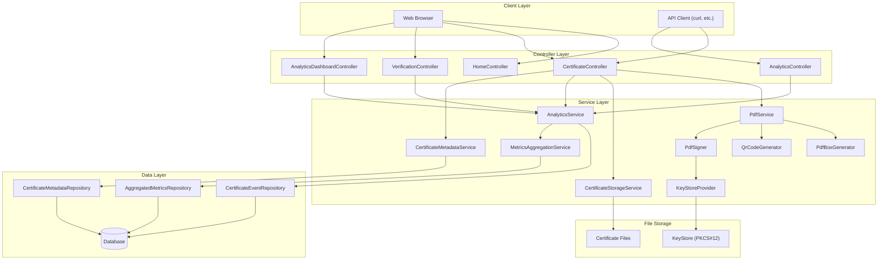
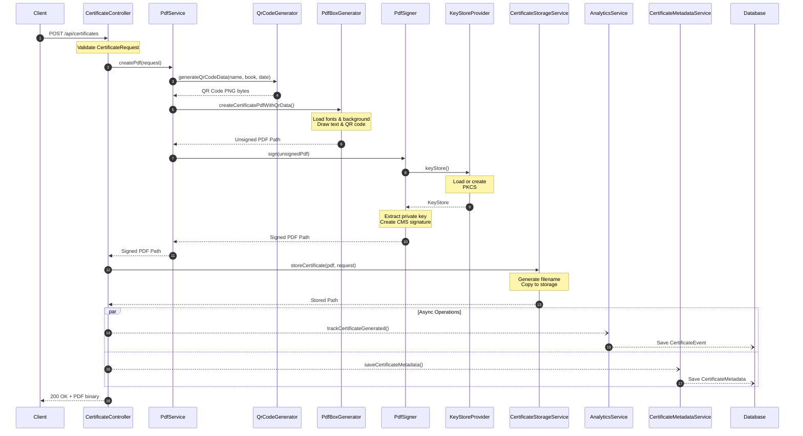
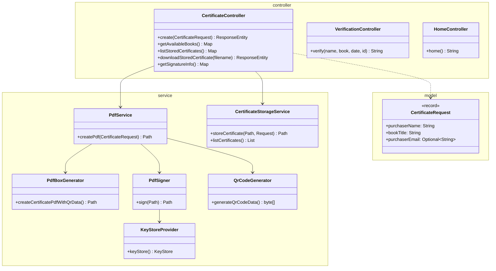
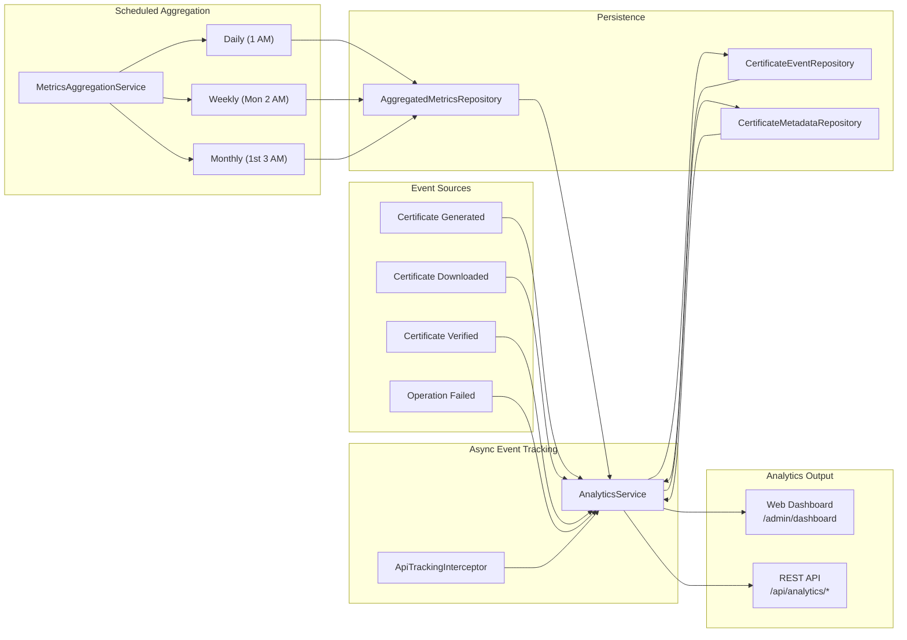
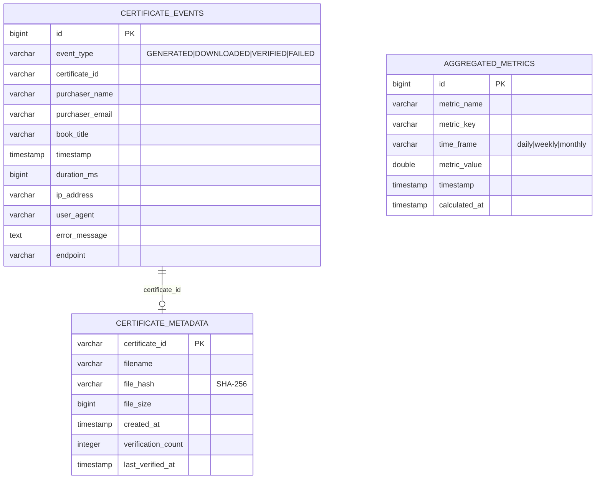
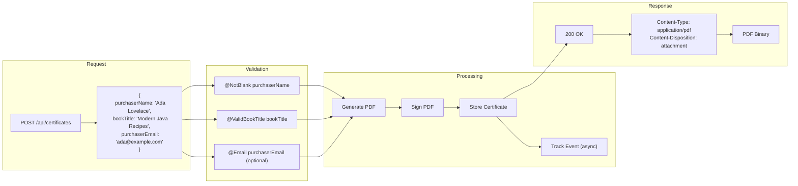

# Certificate Service

A Spring Boot application that generates personalized certificates of ownership for books, complete with digital signatures and QR code verification.

## Live Demo

A deployed version of this service is available at:
**https://certificate-service.kousenit.com**

You can try the certificate generation feature directly on the web interface.

## Overview

This service generates professionally designed certificates of ownership for book purchases. Each certificate:

- Is personalized with the purchaser's name
- Includes the book title
- Features an elegant background design
- Is digitally signed with a 4096-bit RSA key
- Includes a QR code for online verification

## Features

- **PDF Generation**: Creates beautiful certificates using HTML templates rendered to PDF
- **Digital Signatures**: Each PDF is cryptographically signed for authenticity
- **Certificate Verification**: QR codes link to a verification page with signature details
- **Certificate Storage**: Maintains copies of all generated certificates
- **Analytics Dashboard**: Comprehensive analytics with charts, metrics, and usage tracking
- **RESTful API**: Simple API for certificate generation and retrieval

## Technologies

- Java 21 (with virtual threads)
- Spring Boot 3.4
- Spring Data JPA with Hibernate
- H2 Database (development) / PostgreSQL (production)
- PDFBox 3.0 for PDF manipulation and signing
- BouncyCastle for cryptography
- ZXing for QR code generation
- Thymeleaf templating for web UI
- Chart.js for analytics visualizations
- jqwik for property-based testing

## Architecture

### High-Level System Architecture



### Certificate Generation Flow



### Package Structure



### Analytics Subsystem



### Database Schema



### Request/Response Flow



## API Endpoints

### Create a Certificate

```
POST /api/certificates
```

Request body:
```json
{
  "purchaserName": "Ada Lovelace",
  "bookTitle": "Modern Java Recipes",
  "purchaserEmail": "ada@example.com"
}
```

Response: PDF certificate file

### Available Book Titles

```
GET /api/certificates/books
```

Returns the list of available book titles that can be used in certificate generation.

### List Stored Certificates

```
GET /api/certificates/stored
```

Returns a list of all stored certificates.

### Retrieve a Stored Certificate

```
GET /api/certificates/stored/{filename}
```

Returns a specific stored certificate by filename.

### Certificate Verification

```
GET /verify-certificate
```

Displays certificate verification information and instructions for validating the digital signature.

### Analytics Dashboard

```
GET /admin/dashboard
```

Web interface showing comprehensive analytics including:
- Certificate generation metrics and trends
- Book popularity statistics
- Performance metrics and response times
- Recent activity logs

### Analytics API

```
GET /api/analytics/dashboard    # Complete dashboard data
GET /api/analytics/summary      # Summary statistics
GET /api/analytics/trends       # Daily trend data
GET /api/analytics/books        # Book popularity data
GET /api/analytics/performance  # Performance metrics
```

Returns JSON data for programmatic access to analytics.

## Running Locally

### Prerequisites

- Java 21 or higher
- Gradle 8.5 or higher

### Database Configuration

The application uses H2 in-memory database for local development and PostgreSQL for production:

- **Development**: Automatic H2 setup with console at `/h2-console`
- **Production**: Configure `DATABASE_URL` environment variable for PostgreSQL

### Steps

1. Clone the repository
   ```bash
   git clone https://github.com/yourusername/certificate-service.git
   cd certificate-service
   ```

2. Build the application
   ```bash
   ./gradlew build
   ```

3. Run the application
   ```bash
   ./gradlew bootRun
   ```

### Configuration

The service relies on the `certificate.verification.base-url` property to generate absolute QR code links. By default it inherits the `server.url` setting, but you can override it in one of two ways:
1. Set the environment variable (dots become underscores):
   ```bash
   export CERTIFICATE_VERIFICATION_BASE_URL=https://yourdomain.com
   ```
2. Override in `src/main/resources/application.yaml`:
   ```yaml
   certificate:
     verification:
       base-url: https://yourdomain.com
   ```

### Testing

This project uses both traditional unit tests and property-based testing:

1. Run all tests
   ```bash
   ./gradlew test
   ```

2. Run specific property-based tests
   ```bash
   ./gradlew test --tests "com.kousen.cert.service.QrCodeGeneratorPropertyTest"
   ```
3. Run integration (end-to-end) tests
   ```bash
   ./gradlew test --tests "*IntegrationTest"
   ```

Property-based testing systematically tests properties of the application with many random inputs, helping to discover edge cases that traditional unit tests might miss.

4. Generate a certificate (example using curl)
   ```bash
   curl -X POST http://localhost:8080/api/certificates \
        -H "Content-Type: application/json" \
        -d '{"purchaserName":"Ada Lovelace","bookTitle":"Modern Java Recipes"}' \
        -o ada.pdf
   ```

5. Open the generated PDF
   ```bash
   open ada.pdf
   ```

6. View analytics dashboard
   ```
   http://localhost:8080/admin/dashboard
   ```

## Deployment

### Heroku Deployment

The application is configured for easy Heroku deployment with PostgreSQL:

1. **Add PostgreSQL**: `heroku addons:create heroku-postgresql:essential-0`
2. **Set Environment Variables**:
   ```bash
   heroku config:set SPRING_PROFILES_ACTIVE=production
   heroku config:set HIBERNATE_DDL_AUTO=validate
   ```
3. **Deploy**: Standard git push to Heroku

The application automatically detects the Heroku PostgreSQL `DATABASE_URL` and switches from H2 to persistent storage.

## Notes on Digital Signatures

The certificates are signed with a self-signed certificate, which means that Adobe Reader and other PDF readers may display warnings about the signature's validity. This is normal and doesn't affect the integrity of the signature itself. The verification page accessible via the QR code explains how to interpret these warnings.

## Font and Image Assets

Place your custom assets under `src/main/resources`:

```
fonts/CinzelDecorative-Regular.ttf
fonts/GreatVibes-Regular.ttf
images/certificate-bg.png
```

## License

This project is licensed under the MIT License - see the LICENSE file for details.

## Author

Ken Kousen - Tales from the Jar Side