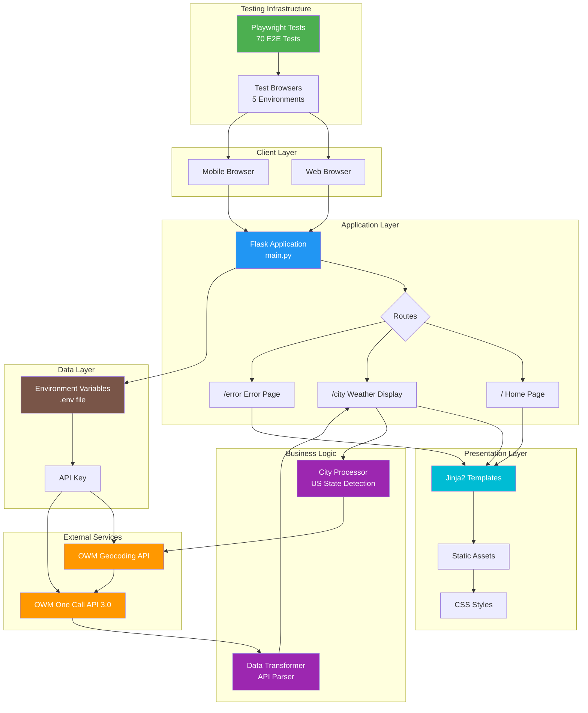

# Weather App Architecture

## System Overview

The Weather App is a Flask-based web application that provides real-time weather information using the OpenWeatherMap API 3.0. It features enhanced US city search capabilities and comprehensive E2E testing.

## Architecture Diagram



## Component Descriptions

### 1. **Client Layer**
- **Web Browser**: Desktop users accessing the application
- **Mobile Browser**: Mobile users with responsive design support

### 2. **Presentation Layer**
- **Jinja2 Templates**: Server-side rendering of HTML
  - `index.html`: Homepage with search functionality
  - `city.html`: Weather display page
  - `error.html`: Error handling page
- **Static Assets**: Images, icons, and CSS files
- **CSS Styles**: Responsive design implementation

### 3. **Application Layer**
- **Flask Application** (`main.py`): Core web server
  - Port: 5001 (configured to avoid conflicts)
  - Debug mode enabled for development
- **Routes**:
  - `/`: Homepage with city search
  - `/<city>`: Weather display for specific city
  - `/error`: Error page for invalid inputs

### 4. **Business Logic**
- **City Name Processor**:
  - US state abbreviation detection (TX, CA, NY, etc.)
  - Full state name recognition (Texas, California, etc.)
  - Automatic "US" country code appending
- **Data Transformer**:
  - Parses One Call API 3.0 responses
  - Extracts current weather, daily forecasts
  - Formats data for template rendering

### 5. **External Services**
- **OpenWeatherMap Geocoding API**:
  - Converts city names to coordinates
  - Handles location disambiguation
- **OpenWeatherMap One Call API 3.0**:
  - Provides current weather data
  - 8-day daily forecasts
  - Hourly forecasts (available but not used)
  - Minute-by-minute data (excluded)

### 6. **Data Layer**
- **Environment Variables**: Secure API key storage
- **.env file**: Contains `OWM_API_KEY`

### 7. **Testing Infrastructure**
- **Playwright E2E Tests**:
  - 70 comprehensive tests
  - Cross-browser testing
  - Mobile viewport testing
  - Automatic server startup
  - HTML report generation

## Data Flow

1. **User Search Flow**:
   ```
   User Input → Flask Route → City Processor → Geocoding API →
   Coordinates → Weather API → Data Transform → Template → Response
   ```

2. **US City Enhancement Flow**:
   ```
   "Austin, TX" → Detect State → Append ", US" →
   "Austin, TX, US" → Geocoding API → Success
   ```

3. **Error Handling Flow**:
   ```
   Invalid City → Geocoding API → Empty Response →
   Redirect → Error Page → Display Message
   ```

## Technology Stack

| Layer | Technology | Purpose |
|-------|------------|---------|
| Frontend | HTML5, CSS3 | User Interface |
| Backend | Flask 2.1.2 | Web Framework |
| Templating | Jinja2 | Dynamic HTML Generation |
| API Client | Requests | HTTP Communication |
| Testing | Playwright | E2E Testing |
| Environment | Python 3.11 | Runtime |
| Version Control | Git | Source Control |

## API Integration

### OpenWeatherMap One Call API 3.0

**Endpoint**: `https://api.openweathermap.org/data/3.0/onecall`

**Request Parameters**:
- `lat`: Latitude
- `lon`: Longitude
- `appid`: API Key
- `units`: metric
- `exclude`: minutely,alerts

**Response Structure**:
```json
{
  "current": {
    "temp": 20,
    "weather": [{"main": "Clear"}],
    "wind_speed": 5.2
  },
  "daily": [
    {
      "temp": {"min": 15, "max": 25, "day": 20},
      "weather": [{"main": "Clouds"}]
    }
  ]
}
```

## Security Considerations

1. **API Key Management**:
   - Stored in `.env` file (not in version control)
   - Accessed via environment variables
   - Never exposed in client-side code

2. **Input Validation**:
   - City names are sanitized
   - Special characters handled gracefully
   - Error pages for invalid inputs

3. **Rate Limiting**:
   - OpenWeatherMap API: 1,000 free calls/day
   - No application-level rate limiting implemented

## Performance Optimizations

1. **Single API Call**:
   - One Call API 3.0 combines all weather data
   - Reduces latency vs. multiple API calls

2. **Efficient Data Processing**:
   - Minimal data transformation
   - Only requested data fields processed

3. **Static Asset Serving**:
   - CSS and images served directly
   - Browser caching enabled

## Testing Strategy

### E2E Test Coverage

| Test Category | Tests | Coverage |
|--------------|-------|----------|
| Homepage | 2 | Search functionality |
| Weather Display | 3 | Data rendering, forecast |
| Error Handling | 3 | Invalid inputs, edge cases |
| US Cities | 4 | State detection, disambiguation |
| Responsive | 2 | Mobile, tablet viewports |

### Browser Coverage

- Desktop: Chrome, Firefox, Safari
- Mobile: Chrome, Safari
- Total: 70 tests (14 tests × 5 browsers)

## Deployment Considerations

1. **Production Settings**:
   - Disable Flask debug mode
   - Use production WSGI server (Gunicorn)
   - Implement proper logging

2. **Environment Variables**:
   - Secure API key storage
   - Configuration management

3. **Scalability**:
   - Consider caching for repeated searches
   - Implement rate limiting
   - Add database for search history

## Future Enhancements

1. **Features**:
   - Weather alerts integration
   - Historical weather data
   - Multiple city comparisons
   - User preferences storage

2. **Technical**:
   - Add Redis caching
   - Implement API retry logic
   - Add comprehensive logging
   - Create Docker container

3. **Testing**:
   - Add unit tests
   - API integration tests
   - Performance testing
   - Load testing